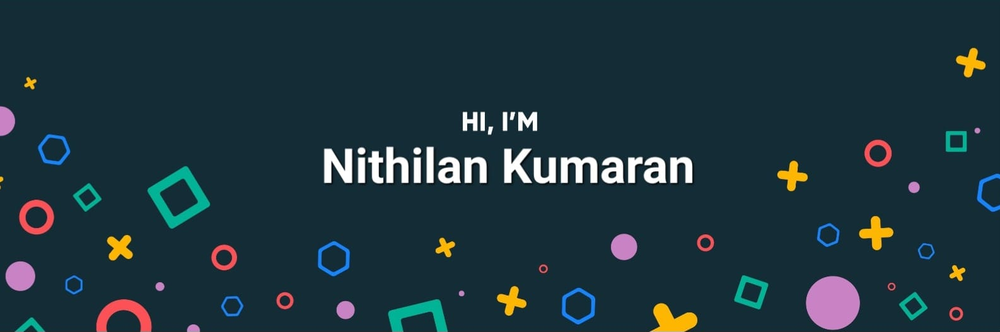

## Hey There 👋

## I'm Nithilan, a passionate Computer Engineering student at UW-Madison with a love for game development and artificial intelligence. I enjoy programming in Python, Lua, C++, and Java. I also write articles about Roblox game devlopment tips and other technologies I learn. I enjoy helping others by sharing my knowledge. I'm always eager to learn more and explore new horizons in technology.

## Want to learn more, check out my website,[Click Here](https://nithilan.dev)

<!-- Pinned Repositories -->

 
<!-- GitHub Stats -->

<!--
**sathariels/sathariels** is a ✨ _special_ ✨ repository because its `README.md` (this file) appears on your GitHub profile.

Here are some ideas to get you started:

- 🔭 I’m currently working on ...
- 🌱 I’m currently learning ...
- 👯 I’m looking to collaborate on ...
- 🤔 I’m looking for help with ...
- 💬 Ask me about ...
- 📫 How to reach me: ...
- 😄 Pronouns: ...
- ⚡ Fun fact: ...
-->
